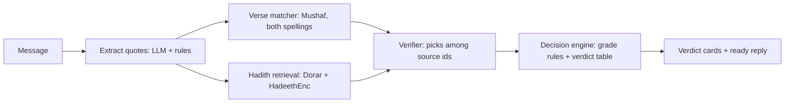

# Mizan | مِيزان

Multilingual Islamic quotation verifier. The frontend treats the verification backend as a REST service.

## What Mizan does

Forward or paste any message in Arabic, English or Urdu. Mizan finds every quoted Quran verse and hadith, checks
each one against approved sources (the King Fahd Complex Mushaf, QuranEnc, HadeethEnc, Dorar.net), and returns a
sourced verdict per quote: **verified**, **misquoted** (with the exact word differences or the correct
surah:ayah), **not established** (all scholars' gradings shown verbatim), **disputed**, **needs review** or
**not found**, plus a polite ready-to-send reply. It never issues fatwas; personal questions are referred to
qualified scholars.

**Deterministic before LLM.** Verse matching, grade classification and verdicts are code; the language model only
extracts quotes, picks among candidate source ids, and phrases the reply. Every text, grading, book and link shown
is copied from the sources.



Details: [docs/ARCHITECTURE.md](docs/ARCHITECTURE.md) · Evaluation: [docs/EVALUATION.md](docs/EVALUATION.md) ·
Content policy: [docs/CONTENT_POLICY.md](docs/CONTENT_POLICY.md) · Sources: [docs/SOURCES.md](docs/SOURCES.md),
[docs/LICENSES.md](docs/LICENSES.md) · Decisions: [docs/DECISIONS.md](docs/DECISIONS.md)

## Results (Mizan-Bench)

Test split (125 items; thresholds frozen on the dev split first; all items still awaiting sharia review):

| | Mizan | LLM alone | Dorar search as-is |
|---|---|---|---|
| **False-verified** (fake / altered text labelled authentic) | **0%** | 30.4% | 15.4% |
| Verdict accuracy | **99.2%** | 78.7% (answered 89/125, quota) | 49.6% |
| Not-established recall | 96.2% | 50.0% | 80.8% |

One run per system (consistency not measured); free tiers only; Mizan latency p50 9.9 s. Method, gaps and limits:
[docs/EVALUATION.md](docs/EVALUATION.md).

## Frontend demo

```sh
cd frontend
npm ci
npm run build
npm run preview
```

See [frontend/README.md](frontend/README.md) for development, demo examples, API configuration, validation, PWA and deployment instructions. The demo uses clearly labelled fixed source-backed fixtures; real verification requires the backend base URL.

The backend-to-frontend interface is documented in [docs/API_CONTRACT.md](docs/API_CONTRACT.md).

## Backend (FastAPI)

Python 3.11. Full setup from scratch:

```sh
cd backend && pip install -r requirements.txt && cd ..
cp .env.example .env                      # fill DATABASE_URL, LLM_*, EMBEDDING_*, GROQ_API_KEY
python scripts/migrate.py                 # schema on Supabase (pgvector)
python scripts/ingest_quran.py            # Mushaf (King Fahd Complex) -> data/quran.json + quran_verses
python scripts/ingest_quranenc.py         # approved en/ur translations
python scripts/ingest_hadeethenc.py --all # HadeethEnc ar/en/ur
python scripts/embed_corpus.py            # optional, daily (free-tier quota, see docs/DECISIONS.md D-19)
cd backend && uvicorn app.main:app --reload --port 8000
```

Tests: `cd backend && pytest -q` (unit) and `pytest -q --live` (real sources, model and DB).
Try the full pipeline on demo messages: `python scripts/try_check.py`.

### Deploy (Render)

`render.yaml` is a Render Blueprint: New > Blueprint > this repo, region Singapore, then paste the secret env
values when asked (`DATABASE_URL`, `LLM_API_KEY`, `EMBEDDING_API_KEY`, `GROQ_API_KEY`, `ALLOWED_ORIGINS`, ...).
The build step downloads the Mushaf from the King Fahd Complex (`ingest_quran.py --no-db`), so the Quran text is
never committed. Health check: `GET /health` (queries the DB, so a pinger keeps both Render and Supabase awake).
Startup loads the Mushaf, the approved translations and the HadeethEnc index (about 1 minute on first boot).
