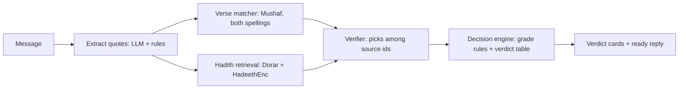

# Mizan | مِيزان

Multilingual Islamic quotation verifier. The frontend treats the verification backend as a REST service.

**Live backend:** https://mizan-backend-d4t5.onrender.com · interactive API docs:
https://mizan-backend-d4t5.onrender.com/docs · health: https://mizan-backend-d4t5.onrender.com/health

**Channels.** The web app (frontend/) and the team's Telegram and WhatsApp bots all call the same endpoint,
`POST /api/v1/check` (contract: [docs/API_CONTRACT.md](docs/API_CONTRACT.md)); the backend's own Telegram webhook is
disabled (D-28).

## What Mizan does

Forward or paste any message in Arabic, English or Urdu. Mizan finds every quoted Quran verse and hadith, checks
each one against approved sources (the King Fahd Complex Mushaf, QuranEnc, HadeethEnc, Dorar.net), and returns a
sourced verdict per quote: **verified**, **misquoted** (with the exact word differences or the correct
surah:ayah), **not established** (all scholars' gradings shown verbatim), **disputed**, **needs review** or
**not found**, plus a polite ready-to-send reply. It never issues fatwas; personal questions are referred to
qualified scholars.

**Deterministic before LLM.** Verse matching, grade classification and verdicts are code; the language model only
extracts quotes, picks among candidate source ids, and phrases the reply. Every text, grading, book and link shown
is copied from the sources.



Details: [docs/ARCHITECTURE.md](docs/ARCHITECTURE.md) · Evaluation: [docs/EVALUATION.md](docs/EVALUATION.md) ·
Content policy: [docs/CONTENT_POLICY.md](docs/CONTENT_POLICY.md) · Sources: [docs/SOURCES.md](docs/SOURCES.md),
[docs/LICENSES.md](docs/LICENSES.md) · Decisions: [docs/DECISIONS.md](docs/DECISIONS.md)

## Results (Mizan-Bench)

Test split (125 items; thresholds frozen on the dev split first; all items still awaiting sharia review):

| | Mizan | LLM alone | Dorar search as-is |
|---|---|---|---|
| **False-verified** (fake / altered text labelled authentic) | **0%** | 20.5% | 15.4% |
| Verdict accuracy | **99.2%** | 73.6% | 49.6% |
| Not-established recall | 96.2% | 30.8% | 80.8% |

One run per system (consistency not measured); free tiers only; Mizan latency p50 9.9 s. Method, gaps and limits:
[docs/EVALUATION.md](docs/EVALUATION.md).

## Frontend demo

```sh
cd frontend
npm ci
npm run build
npm run preview
```

See [frontend/README.md](frontend/README.md) for development, demo examples, API configuration, validation, PWA and deployment instructions. The demo uses clearly labelled fixed source-backed fixtures; real verification requires the backend base URL.

The backend-to-frontend interface is documented in [docs/API_CONTRACT.md](docs/API_CONTRACT.md).

## Backend (FastAPI): run from scratch

Python 3.11 and a Supabase (Postgres + pgvector) project. The data steps run **once, from a developer machine**,
and fill Supabase; the deployed server only reads Supabase and never downloads source data (D-29).

```sh
cd backend && pip install -r requirements.txt && cd ..
cp .env.example .env                      # fill DATABASE_URL (session pooler, port 5432), LLM_*, EMBEDDING_*, GROQ_API_KEY
python scripts/migrate.py                 # schema (pgvector)
python scripts/ingest_quran.py            # Mushaf from the King Fahd Complex -> quran_verses (dev machine only)
python scripts/ingest_quranenc.py         # approved en/ur translations -> quran_translations
python scripts/ingest_hadeethenc.py --all # HadeethEnc ar/en/ur -> hadiths, hadith_translations
python scripts/embed_corpus.py            # optional, daily (free-tier quota, D-19)
cd backend && uvicorn app.main:app --port 8000   # http://localhost:8000/docs
```

Tests: `cd backend && pytest -q` (unit) and `pytest -q --live` (real sources, model and DB).
Demo inputs through the full pipeline: `python scripts/try_check.py --video`.

### Deploy (Render)

`render.yaml` is a Render Blueprint. Build: `pip install -r backend/requirements.txt` only; start:
`cd backend && uvicorn app.main:app --host 0.0.0.0 --port $PORT`. Paste the secret env values when asked
(`DATABASE_URL`, `LLM_API_KEY`, `EMBEDDING_API_KEY`, `GROQ_API_KEY`, `ALLOWED_ORIGINS`, `PUBLIC_WEB_URL`). At
startup the server loads the Mushaf, approved translations and the HadeethEnc index from Supabase (~1 min on first
boot). `GET /health` queries the DB, so an uptime pinger keeps both Render and Supabase awake. Before judging:
`python scripts/warm_cache.py --api <URL>`.
