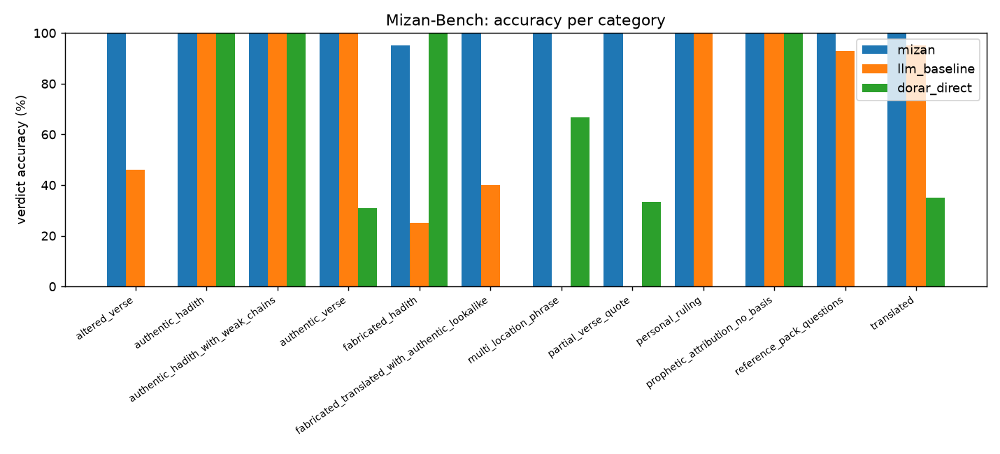

# Mizan-Bench results (test split)

Items: 125 (0 reviewed by the sharia reviewer, 125 unreviewed).
Thresholds were tuned on the dev split only and frozen before this run (methodological safeguard).

| Metric | mizan | llm_baseline | dorar_direct |
|---|---|---|---|
| Verdict accuracy | 99.2% (124/125) | 73.6% (92/125) | 49.6% (62/125) |
| Not-established recall | 96.2% (25/26) | 30.8% (8/26) | 80.8% (21/26) |
| False-verified rate (target 0) | 0.0% (0/39) | 20.5% (8/39) | 15.4% (6/39) |
| Hallucination rate | 4.8% (5/104) | 8.0% (7/87) | n/a |
| Abstention / referral correctness | 100.0% (20/20) | 95.0% (19/20) | 0.0% (0/20) |
| Consistency | n/a (1 run) | n/a (1 run) | n/a (1 run) |
| Latency p50 (ms) | 9909 | 5466 | 1851 |
| Latency p95 (ms) | 18487 | 9823 | 2839 |
| Mean cost per check (USD) | 0.00000 | 0.00000 | 0.00000 |
| Items answered | 125 | 125 | 125 |

## Accuracy per category

| | mizan | llm_baseline | dorar_direct |
|---|---|---|---|
| altered_verse | 100.0% (13/13) | 46.2% (6/13) | 0.0% (0/13) |
| authentic_hadith | 100.0% (20/20) | 100.0% (20/20) | 100.0% (20/20) |
| authentic_hadith_with_weak_chains | 100.0% (7/7) | 100.0% (7/7) | 100.0% (7/7) |
| authentic_verse | 100.0% (13/13) | 100.0% (13/13) | 30.8% (4/13) |
| fabricated_hadith | 95.0% (19/20) | 25.0% (5/20) | 100.0% (20/20) |
| fabricated_translated_with_authentic_lookalike | 100.0% (5/5) | 40.0% (2/5) | 0.0% (0/5) |
| multi_location_phrase | 100.0% (3/3) | 0.0% (0/3) | 66.7% (2/3) |
| partial_verse_quote | 100.0% (3/3) | 0.0% (0/3) | 33.3% (1/3) |
| personal_ruling | 100.0% (6/6) | 100.0% (6/6) | 0.0% (0/6) |
| prophetic_attribution_no_basis | 100.0% (1/1) | 100.0% (1/1) | 100.0% (1/1) |
| reference_pack_questions | 100.0% (14/14) | 92.9% (13/14) | 0.0% (0/14) |
| translated | 100.0% (20/20) | 95.0% (19/20) | 35.0% (7/20) |

## Accuracy per language

| | mizan | llm_baseline | dorar_direct |
|---|---|---|---|
| ar | 98.9% (88/89) | 68.5% (61/89) | 61.8% (55/89) |
| en | 100.0% (21/21) | 81.0% (17/21) | 0.0% (0/21) |
| ur | 100.0% (15/15) | 93.3% (14/15) | 46.7% (7/15) |

## Charts

## Hallucination check: manual agreement

Manual review of a random sample of 30 `llm_baseline` outputs against the automatic check (§11.4):

- Sample reviewed: _ / 30
- Agreement with the automatic check: _ %

